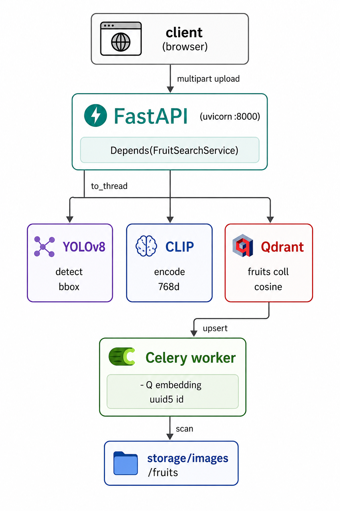

# 유사 이미지 검색 API

FastAPI 기반 유사 이미지 검색 서비스. 사용자가 업로드한 이미지에서 객체를 검출하고, 임베딩 벡터로 변환한 뒤 Qdrant에서 유사 이미지를 찾아 반환합니다.

> 단일 이미지에서 YOLOv8로 객체를 추출하고, CLIP 모델로 임베딩한 후 벡터 데이터베이스(Qdrant)에서 유사한 이미지 상위 5개를 조회합니다. 백그라운드 임베딩은 Celery + Redis로 비동기 처리됩니다.

---

## 목차

1. [핵심 특징](#핵심-특징)
2. [아키텍처](#아키텍처)
3. [기술 스택](#기술-스택)
4. [프로젝트 구조](#프로젝트-구조)
5. [API 명세](#api-명세)
6. [실행 방법](#실행-방법)
7. [환경변수](#환경변수)
8. [임베딩 파이프라인 (Celery)](#임베딩-파이프라인-celery)
9. [최근 적용된 개선](#최근-적용된-개선)
10. [남은 제한 사항 & 다음 단계](#남은-제한-사항--다음-단계)
11. [실행 화면](#실행-화면)

---

## 핵심 특징

| 영역 | 내용 |
|---|---|
| **객체 검출** | YOLOv8(`yolov8n-oiv7.pt`, Open Images v7 사전학습)로 입력 이미지에서 가장 신뢰도 높은 객체 1개를 추출하고 bounding box 산출 |
| **이미지 임베딩** | SentenceTransformer CLIP `ViT-L-14` (768차원, Cosine 거리)로 크롭된 객체를 벡터화 |
| **벡터 검색** | Qdrant 벡터 DB의 `fruits` 컬렉션에서 상위 5개 유사 이미지를 검색 |
| **백그라운드 임베딩** | Celery + Redis로 데이터셋 이미지의 대량 임베딩을 비동기 처리 |
| **의존성 주입 / 모델 싱글톤** | `lru_cache`로 Qdrant·CLIP·YOLO를 프로세스당 1회만 로드. FastAPI는 `Depends`로, Celery 워커는 동일 캐시 함수 직접 호출 |
| **lifespan 워밍업** | 앱 부팅 시 모델/클라이언트 미리 로드 → 첫 요청 지연 제거 |
| **이벤트 루프 보호** | YOLO·CLIP·Qdrant 동기 호출을 `asyncio.to_thread()`로 워커 스레드에 위임 |
| **버전 라우팅** | `app/api/v1/`에서 라우터를 `pkgutil`로 자동 수집해 `/api/v1/...`로 등록 |

---

## 아키텍처


### 유사 이미지 검색 흐름

```
[Client]        [FastAPI]             [Storage]         [Qdrant]
   │               │                     │                 │
   │ POST /image   │                     │                 │
   ├──────────────►│                     │                 │
   │               │ validate file       │                 │
   │               │ save temp           ├───────────────► │
   │               │                     │                 │
   │               │ asyncio.to_thread() │                 │
   │               │   ├─ YOLO detect    │                 │
   │               │   │   → bbox        │                 │
   │               │   └─ CLIP encode    │                 │
   │               │       → 768-dim     │                 │
   │               │                     │                 │
   │               │ Qdrant search       ├───────────────► │
   │               │                     │ ◄───────────────┤
   │               │ delete temp         │                 │
   │               │                     │                 │
   │ {images[...]} │                     │                 │
   │◄──────────────┤                     │                 │
```

### 데이터셋 임베딩 (Celery 배경 작업)

```
[Celery Worker]        [Dataset]           [Qdrant]
       │                   │                  │
       │ scan images       ├─────────────────►│ (read)
       │                   │                  │
       │ for each image    │                  │
       │──────────────────────────────────────│
       │  YOLO detect                         │
       │   → bbox                             │
       │  CLIP encode                         │
       │   → vector (768-dim)                 │
       │                                      │
       │ upsert vector ──────────────────────►│
       │                                      │
```

---

## 기술 스택

### Runtime
- **Python** 3.11+
- **FastAPI** 0.136.0
- **Uvicorn[standard]** 0.44.0 (uvloop, httptools, watchfiles)
- **Pydantic** 2.13.2 / **pydantic-settings** 2.13.1
- **python-multipart** (multipart/form-data)

### 머신러닝 / 벡터 검색
- **YOLOv8** (객체 검출, `yolov8n-oiv7.pt` Open Images v7)
- **SentenceTransformer** 5.4.1 + **CLIP ViT-L-14** (768차원 임베딩)
- **qdrant-client** 1.17.1 (Qdrant 서버 v1.15.4)
- **torch** 2.11.0, **ultralytics** 8.4.40

### Async Task & Queue
- **Celery** 5.6.3
- **Redis** 7.4.0 (broker + result backend)
- **Flower** 2.0.1 (모니터링 UI)

### Image Processing
- **Pillow** 12.2.0
- **NumPy** 2.4.4

### Dev / Test / Tooling
- **pytest** + **pytest-asyncio** (테스트, 현재 비어 있음)
- **uv** (`uv.lock` 기반 재현 가능한 설치)

---

## 프로젝트 구조

```text
fastapi-imageSearch/
├── app/
│   ├── api/
│   │   ├── __init__.py                 # /api 루트 + pkgutil 자동 수집
│   │   └── v1/
│   │       ├── __init__.py             # /v1 + 하위 라우터 자동 등록
│   │       └── image_search/
│   │           ├── __init__.py
│   │           └── router.py           # POST /api/v1/image
│   ├── core/
│   │   ├── config.py                   # pydantic-settings 환경 설정
│   │   ├── logging.py
│   │   ├── dependencies/
│   │   │   ├── common.py               # get_qdrant_client / get_embedding_model / get_yolo_model (lru_cache)
│   │   │   └── image_search.py         # FruitPointService / FruitSearchService 팩토리
│   │   ├── exceptions/
│   │   │   ├── custom.py               # BusinessException
│   │   │   └── handler.py              # 글로벌 예외 핸들러 등록
│   │   └── utils/
│   │       ├── image.py                # 이미지 비율 계산
│   │       ├── response.py             # 성공/오류 응답 헬퍼
│   │       └── url.py                  # 정적 이미지 URL 변환
│   ├── infrastructure/
│   │   ├── storage/image.py            # 임시 이미지 저장 / 데이터셋 경로 조회
│   │   └── vectordb/qdrant.py          # Qdrant 클라이언트 래퍼 (client 주입형)
│   ├── schemas/
│   │   ├── common.py                   # SuccessResponse / ErrorResponse 제네릭
│   │   └── image_search/response.py    # ImageSearchResponse
│   ├── services/
│   │   └── fruit/
│   │       ├── point.py                # FruitPointService (qdrant/embed/yolo 인자 주입형)
│   │       └── search.py               # FruitSearchService (검색 파이프라인, asyncio.to_thread)
│   ├── worker/
│   │   ├── celery_app.py               # Celery 앱 (queue: embedding)
│   │   └── tasks/
│   │       ├── __init__.py
│   │       ├── add.py                  # 샘플 태스크
│   │       └── embedding.py            # embed_fruit_images (lru_cache 캐시 함수 직접 호출)
│   └── main.py                         # FastAPI 진입점 (lifespan 워밍업, CORS, 예외 등록)
├── config/
│   └── embedding_model.py              # CLIP 모델 메타 (ViT-B/32, ViT-L/14)
├── storage/
│   ├── images/fruits/                  # 임베딩 대상 데이터셋
│   └── screenshots/                    # README 스크린샷
├── notebooks/                          # Jupyter 탐색 노트북
├── tests/                              # (현재 비어 있음)
├── docker-compose.yml
├── pyproject.toml
├── uv.lock
├── yolov8n-oiv7.pt                     # YOLO 가중치 (Open Images v7)
└── README.md
```

---

## API 명세

모든 엔드포인트는 `/api/v1` 프리픽스 아래에 있습니다.

### 이미지 검색

| Method | Path | 설명 |
|---|---|---|
| `POST` | `/api/v1/image` | 업로드 이미지 → 객체 검출 → 임베딩 → Qdrant 검색 |

**요청** (multipart/form-data):
- `file` — 이미지 파일 (필수)

**응답** (성공 200):
```json
{
  "code": 200,
  "data": [
    {
      "id": "8f1d...",
      "image_path": "/static/images/fruits/apple_01.jpg",
      "bbox": [12, 34, 220, 240],
      "score": 0.8721
    },
    ...
  ]
}
```

**에러 응답** (422 UNPROCESSABLE_ENTITY):
- 검출된 객체가 없거나 bounding box 크기/비율이 임계치(`min_size=10px`, `min_ratio=0.01`) 미만일 경우

```json
{
  "code": 422,
  "message": "Validation Error",
  "errors": [...]
}
```

---

## 실행 방법

### 사전 요구
- **Docker** + **Docker Compose** (권장)
- 또는 **Python 3.11+** & **uv**

### 1) Docker Compose (권장)

```bash
git clone <repo-url>
cd fastapi-imageSearch
cp .env.example .env        # 필요한 값 채우기
docker compose up -d qdrant redis
docker compose up -d app celery flower
```

기동되는 서비스:

| 컨테이너 | 포트 | 역할 |
|---|---|---|
| `app` (FastAPI) | `9100:8000` | API |
| `qdrant` | `6333` (HTTP), `6334` (gRPC) | 벡터 DB |
| `redis` | `6379` | Celery 브로커/백엔드 |
| `celery` | — | Celery 워커 |
| `flower` | `5555:5555` | 모니터링 UI |

엔드포인트:
- API:           `http://localhost:9100`
- Swagger UI:    `http://localhost:9100/docs`
- ReDoc:         `http://localhost:9100/redoc`
- Flower:        `http://localhost:5555`

### 2) 로컬 (uv)

```bash
uv sync                      # uv.lock 기반 재현 가능 설치
cp .env.example .env         # 로컬 QDRANT_HOST 등 수정

# API (터미널 1)
uv run uvicorn app.main:app --reload --host 0.0.0.0 --port 8000

# Celery 워커 (터미널 2)
uv run celery -A app.worker.celery_app worker --loglevel=info

# Flower 모니터링 (터미널 3, 선택사항)
uv run celery -A app.worker.celery_app flower --port=5555
```

### 3) 빠른 동작 확인

```bash
# 1. 헬스체크
curl http://localhost:9100/

# 2. 유사 이미지 검색 (jpg/png 이미지 준비)
curl -X POST http://localhost:9100/api/v1/image \
  -F "file=@/path/to/image.jpg"
```

---

## 환경변수

`.env` 파일에 아래 값을 설정합니다. `.env.example`을 복사해 사용하세요.

### App 설정

```env
QDRANT_HOST=http://fastapi_imageSearch-qdrant:6333
STORAGE_PATH=storage
ALLOWED_ORIGINS=http://localhost:3000,http://localhost:5173
```

### Celery / Redis

```env
CELERY_BROKER_URL=redis://fastapi_imageSearch-redis:6379/0
CELERY_RESULT_BACKEND=redis://fastapi_imageSearch-redis:6379/1
```

| 변수 | 설정값 예시 | 설명 |
|---|---|---|
| `QDRANT_HOST` | `http://fastapi_imageSearch-qdrant:6333` | Qdrant 서버 URL |
| `CELERY_BROKER_URL` | `redis://fastapi_imageSearch-redis:6379/0` | Celery 메시지 브로커 |
| `CELERY_RESULT_BACKEND` | `redis://fastapi_imageSearch-redis:6379/1` | Celery 작업 결과 백엔드 |
| `STORAGE_PATH` | `storage` | 정적 이미지 루트 (앱 BASE_DIR 기준) |
| `ALLOWED_ORIGINS` | `http://localhost:3000,...` | CORS 허용 origin (콤마 구분) |

---

## 임베딩 파이프라인 (Celery)

`app/worker/tasks/embedding.py`의 `embed_fruit_images` 태스크는 `storage/images/fruits/` 디렉터리의 이미지를 순회하면서 다음을 수행합니다:

### 처리 흐름

1. **YOLO 객체 검출** → 가장 신뢰도 높은 객체 1개 선택
2. **CLIP 임베딩** → 크롭한 영역을 768차원 벡터로 변환
3. **PointStruct 생성** → `id=uuid4`, `vector=[...]`, `payload={image_path, bbox}`
4. **Qdrant 저장** → `fruits` 컬렉션에 upsert

### 실행 (Celery Flower 또는 CLI)

```bash
# Flower 웹 UI에서 직접 태스크 호출
# http://localhost:5555

# 또는 CLI
celery -A app.worker.celery_app call app.worker.tasks.embedding.embed_fruit_images
```

> ⚠️ **사전 조건**: Qdrant `fruits` 컬렉션은 다음 설정으로 사전 생성되어야 합니다:
> ```python
> vectors_config={"size": 768, "distance": "Cosine"}
> ```

---

## 최근 적용된 개선

### 의존성 주입 (DI) 도입

- `app/core/dependencies/common.py`: `get_qdrant_client`, `get_embedding_model`, `get_yolo_model`을 `@lru_cache(maxsize=1)`로 정의
- `dependencies/image_search.py`: `FruitPointService`, `FruitSearchService` 팩토리 제공
- 라우터는 `Depends(get_fruit_search_service)`로 주입받음

### 모델 싱글톤화

- 라우터 import 시점의 모델 로드 문제 해소
- 프로세스당 1회만 로드, FastAPI/Celery 워커 모두 동일 캐시 함수 재사용

### lifespan 워밍업

- `app/main.py`에 `@asynccontextmanager` 기반 lifespan 추가
- 앱 부팅 시 Qdrant·CLIP·YOLO 미리 로드 → 첫 요청 지연 제거
- 종료 시 Qdrant 클라이언트 graceful close

### 이벤트 루프 블로킹 해소

- `FruitSearchService.get_similarity_images`의 모든 동기 작업을 `asyncio.to_thread()`로 감쌈
- YOLO 추론, CLIP encode, Qdrant 쿼리 → 워커 스레드에서 실행

### Qdrant 래퍼 의존성 주입

- `Qdrant(client: QdrantClient)` 시그니처로 변경
- 내부에서 `config` 직접 참조 제거 → 테스트 용이

---

## 남은 제한 사항 & 다음 단계

### 현재 제한 사항

| 항목 | 상태 | 설명 |
|---|---|---|
| **Qdrant 컬렉션 자동 생성** | ❌ | `fruits` 컬렉션을 사전 생성해야 함 |
| **응답 스키마 일치성** | ⚠️ | `response_model`과 실제 반환값 타입 불일치 |
| **Celery 워커 튜닝** | ⚠️ | `task_acks_late`, `worker_prefetch_multiplier` 미설정 |
| **테스트 커버리지** | ❌ | `tests/` 디렉터리 비어 있음 |
| **도메인 리포지토리** | ⚠️ | Qdrant 래퍼의 추상화 가치 재검토 필요 |

### 권장 다음 단계

1. **lifespan 보강**: `client.collection_exists("fruits")` → 없으면 `create_collection()` 자동 생성
2. **테스트 작성**: `tests/`에 라우터·서비스 단위 테스트 (`app.dependency_overrides` 이용)
3. **리포지토리 패턴**: `Qdrant` 래퍼를 도메인 리포지토리로 승격 또는 제거
4. **응답 스키마 정정**: 타입 힌트 통일 및 문서화

---

## 실행 화면

### 샘플 이미지


### Swagger UI
FastAPI가 자동 생성하는 OpenAPI 문서로 모든 엔드포인트의 요청/응답 스키마와 예시를 인터랙티브하게 확인할 수 있습니다.

- Swagger UI: `http://localhost:9093/docs`
- ReDoc: `http://localhost:9093/redoc`

---