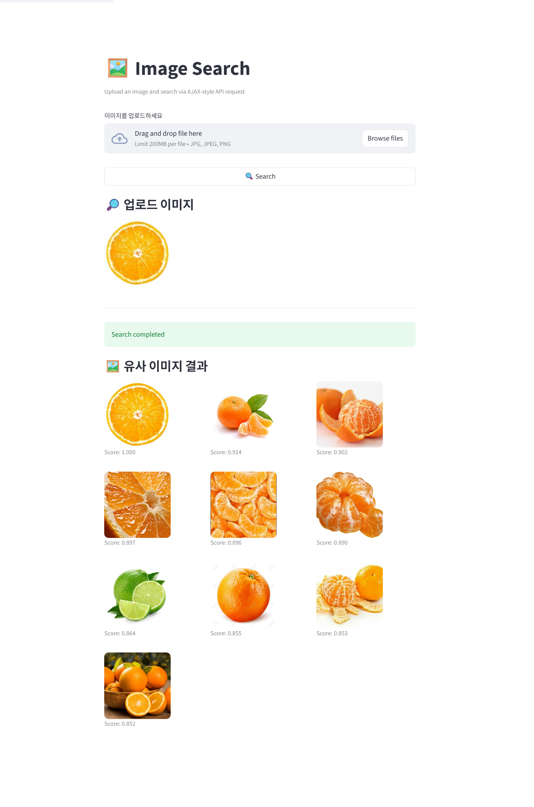

# 유사 이미지 검색 API

FastAPI 기반 유사 이미지 검색 서비스. 사용자가 업로드한 이미지에서 객체를 검출하고, 임베딩 벡터로 변환한 뒤 Qdrant에서 유사 이미지를 찾아 반환합니다.

## 🚀 주요 기능

- **객체 검출**: YOLOv8(`yolov8n-oiv7.pt`)으로 입력 이미지에서 가장 신뢰도 높은 객체를 추출하고 bounding box를 산출
- **이미지 임베딩**: SentenceTransformer의 CLIP `ViT-L-14`(768차원, Cosine) 모델로 크롭된 객체를 벡터화
- **벡터 검색**: Qdrant `fruits` 컬렉션에서 상위 5개 유사 이미지를 검색
- **백그라운드 임베딩**: Celery + Redis로 데이터셋 임베딩 작업을 비동기 처리
- **버전 라우팅**: `app/api/v1/`에서 라우터를 자동 수집하여 `/api/v1/...`로 등록

## 🛠️ 기술 스택

| 영역 | 사용 기술 |
|---|---|
| Web | FastAPI 0.136.0, Uvicorn 0.44.0 (standard), python-multipart |
| 검증/설정 | Pydantic 2.13.2, pydantic-settings 2.13.1 |
| 벡터 DB | qdrant-client 1.17.1 (Qdrant 서버 v1.15.4) |
| 임베딩 / 검출 | sentence-transformers 5.4.1, ultralytics 8.4.40, torch 2.11.0 |
| 작업 큐 | Celery 5.6.3, Redis 7.4.0, Flower 2.0.1 |
| 이미지 | Pillow 12.2.0, NumPy 2.4.4 |
| 테스트 | pytest, pytest-asyncio |
| 런타임 | Python 3.11+ |

## 📦 프로젝트 구조

```text
fastapi-imageSearch/
├── app/
│   ├── api/
│   │   ├── __init__.py                 # pkgutil 기반 라우터 자동 수집
│   │   └── v1/
│   │       └── image_search/
│   │           └── router.py           # POST /api/v1/image
│   ├── core/
│   │   ├── config.py                   # pydantic-settings 환경 설정
│   │   ├── logging.py                  # 로깅 초기화
│   │   ├── exceptions/
│   │   │   ├── custom.py               # BusinessException
│   │   │   └── handler.py              # 글로벌 예외 핸들러 등록
│   │   └── utils/
│   │       ├── image.py                # 이미지 비율 계산
│   │       ├── url.py                  # 정적 이미지 URL 변환
│   │       └── response.py             # 성공/오류 응답 헬퍼
│   ├── infrastructure/
│   │   ├── storage/image.py            # 임시 이미지 저장 / 데이터셋 경로 조회
│   │   └── vectordb/qdrant.py          # Qdrant 클라이언트 래퍼
│   ├── schemas/
│   │   ├── common.py                   # SuccessResponse / ErrorResponse 제네릭
│   │   └── image_search/response.py    # ImageSearchResponse
│   ├── services/
│   │   └── fruit/
│   │       ├── point.py                # FruitPointService (YOLO+CLIP+Qdrant 업서트)
│   │       └── search.py               # FruitSearchService (검색 파이프라인)
│   ├── worker/
│   │   ├── celery_app.py               # Celery 앱 (queue: embedding)
│   │   └── tasks/
│   │       ├── add.py                  # 샘플 태스크
│   │       └── embedding.py            # embed_fruit_images 태스크
│   └── main.py                         # FastAPI 진입점 (CORS, 라우터, 예외 등록)
├── config/
│   └── embedding_model.py              # CLIP 모델 메타 (ViT-B/32, ViT-L/14)
├── notebooks/                          # 실험 노트북
├── storage/
│   ├── images/fruits/                  # 임베딩 대상 데이터셋
│   └── screenshots/                    # README 스크린샷
├── tests/                              # (현재 비어 있음)
├── docker-compose.yml                  # mysql/mongo/qdrant/redis/app/celery/flower
├── pyproject.toml
├── uv.lock
├── yolov8n-oiv7.pt                     # YOLO 가중치 (Open Images v7 사전학습)
├── CELERY_MIGRATION.md
└── README.md
```

> 참고: `docker-compose.yml`에는 `mysql`, `mongo` 서비스도 정의되어 있지만 현재 애플리케이션 코드에서는 사용하지 않습니다.

## ⚙️ 환경 변수

`.env` 파일에 아래 값을 설정합니다 (`app/core/config.py`).

| 변수 | 예시 | 설명 |
|---|---|---|
| `QDRANT_HOST` | `http://fastapi_imageSearch-qdrant:6333` | Qdrant 서버 URL |
| `CELERY_BROKER_URL` | `redis://fastapi_imageSearch-redis:6379/0` | Celery 브로커 |
| `CELERY_RESULT_BACKEND` | `redis://fastapi_imageSearch-redis:6379/1` | Celery 결과 백엔드 |
| `STORAGE_PATH` | `storage` | 정적 이미지 루트 (앱 BASE_DIR 기준) |
| `ALLOWED_ORIGINS` | `http://localhost:3000,http://localhost:5173` | CORS 허용 origin (콤마 구분) |

## 🐳 실행 (Docker Compose)

```bash
docker compose up -d qdrant redis
docker compose up -d app celery flower
```

| 서비스 | 포트 | 용도 |
|---|---|---|
| app (FastAPI) | `9100 → 8000` | API |
| Qdrant | `6333` (HTTP), `6334` (gRPC) | 벡터 DB |
| Redis | `6379` | Celery 브로커/백엔드 |
| Flower | `5555` | Celery 모니터링 |

## 📡 API

### `POST /api/v1/image`

업로드한 이미지에 대해 객체 검출 → 임베딩 → Qdrant 검색을 수행하고 상위 5개 유사 이미지를 반환합니다.

- **요청**: `multipart/form-data`
  - `file`: `UploadFile` (필수)
- **응답 예시**:

```json
{
  "code": 200,
  "data": [
    {
      "id": "8f1d...",
      "image_path": "/static/images/fruits/apple_01.jpg",
      "bbox": [12, 34, 220, 240],
      "score": 0.8721
    }
  ]
}
```

검출된 객체가 없거나 bounding box 크기/비율이 임계치(`min_size=10px`, `min_ratio=0.01`) 미만이면 `422 UNPROCESSABLE_ENTITY`(`BusinessException`)이 반환됩니다.

### 헬스체크

- `GET /` → `{"message": "Hello FastAPI"}`

## 🧪 임베딩 파이프라인 (Celery)

`app/worker/tasks/embedding.py`의 `embed_fruit_images` 태스크는 `storage/images/fruits/`의 이미지를 순회하면서 다음을 수행합니다.

1. YOLO 추론 → 가장 신뢰도 높은 객체 1개 선택
2. 크롭한 영역을 CLIP으로 인코딩 (768차원)
3. `PointStruct(id=uuid4, vector=..., payload={image, bbox})` 생성
4. Qdrant `fruits` 컬렉션에 `upsert`

> Qdrant 컬렉션은 사전에 `vectors_config={"size": 768, "distance": "Cosine"}`로 생성되어 있어야 합니다. 자동 생성 로직은 아직 없습니다.

## ⚠️ 알려진 제한 사항 / 개선 과제

상세 분석은 [`docs/REVIEW.md`](docs/REVIEW.md) 참고. 요약:

- **의존성 주입 부재**: 라우터 모듈 임포트 시점에 `FruitSearchService()`가 즉시 생성되며, CLIP과 YOLO 모델이 함께 로드됩니다 (`app/api/v1/image_search/router.py:11`, `app/services/fruit/point.py:18-20`). 테스트가 어렵고 import 비용이 큽니다.
- **Qdrant 클라이언트 재생성**: `Qdrant()`는 서비스가 만들어질 때마다 새 `QdrantClient`를 생성합니다 (`app/infrastructure/vectordb/qdrant.py:6-8`). Celery 태스크에서는 호출마다 클라이언트가 새로 생깁니다.
- **lifespan 부재**: `app/main.py`에 startup/shutdown 또는 `lifespan` 컨텍스트가 없어 모델 워밍업·연결 종료 처리가 없습니다.
- **async 안에서 동기 CPU 호출**: 라우터가 `async def`이지만 YOLO 추론과 CLIP 인코딩은 동기 호출이라 이벤트 루프를 블로킹합니다.
- **Celery 워커 튜닝 부족**: `task_acks_late`, `worker_prefetch_multiplier`, `task_time_limit` 미설정. 매 태스크마다 모델을 재로드.
- **죽은 코드**: 빈 `app/modules/vectordb/qdrant.py`, 사용되지 않는 `app/core/config.py:21` 모듈 변수.
- **응답 스키마 불일치**: `response_model=ImageSearchResponse`(`SuccessResponse[dict]`)인데 실제 데이터는 `list[dict]` (`app/api/v1/image_search/router.py:13-18`).
- **테스트 부재**: `tests/` 디렉터리는 존재하지만 테스트 파일이 없습니다.

### 권장 개선 순서

1. `app/core/dependencies.py` 신설 + `lifespan`으로 Qdrant/CLIP/YOLO 싱글톤 워밍업, 라우터에 `Depends` 주입
2. Celery 워커는 `worker_process_init` 시그널에서 모델/클라이언트 한 번만 로드
3. YOLO·CLIP 호출을 `asyncio.to_thread()`로 감싸거나 검색 자체를 Celery로 이관
4. Qdrant 래퍼를 도메인 리포지토리(`FruitVectorRepo`)로 승격하거나 제거
5. `tests/`에 라우터·서비스 단위 테스트 추가 (`app.dependency_overrides`로 mock 주입)

## 📸 실행 화면



